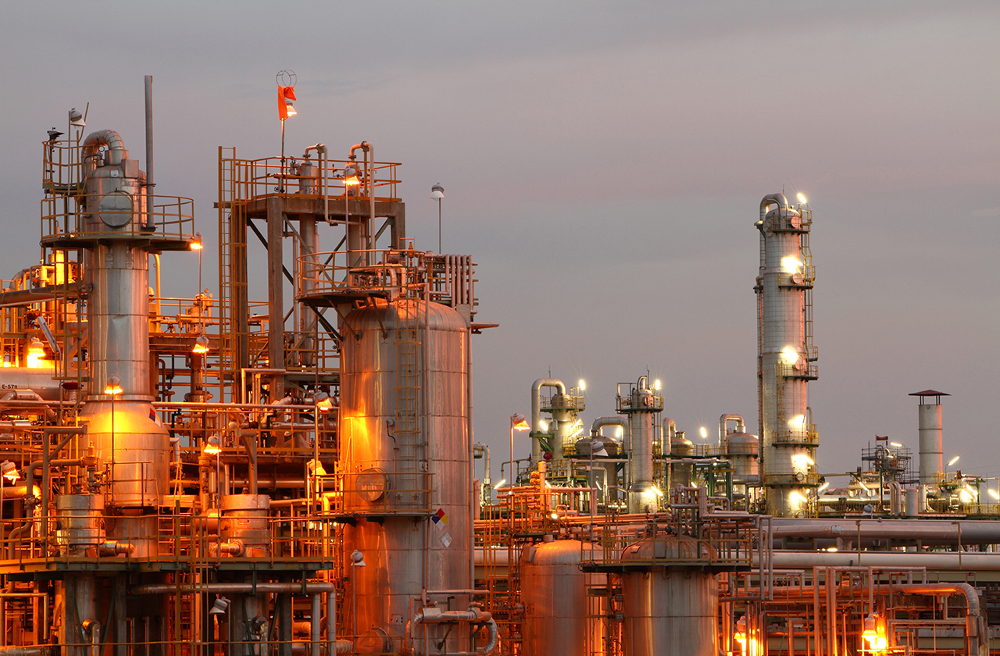

# Process Simulation of Methanol Production from Syngas

**Author:** [Rajdeep Dev](https://rajdeepdev10.github.io)
**UBC ID:** 71666887

 
*image_caption*

## Process Description

This project will focus on the production process of methanol from syngas. Syngas is a fuel mixture produced from natural gas that consists primarily of hydrogen, carbon monoxide, and carbon dioxide with small amounts of water, nitrogen, and methanol. On an industrial scale, methanol is predominantly produced from the reaction of hydrogen with carbon monoxide and carbon dioxide. The resulting gas mixture is then distilled to create pure methanol [1]. This process is comprised of the following reactions is carried out at varying conditions [2]:

  $$CO + 2H_{2}\rightarrow CH_{3}OH$$ (1) 
  $$CO_{2} + 3H_{2} \rightarrow CO + H_{2}O$$ (2) 
  $$CO + H_{2}O \rightarrow CO_{2} + H_{2}$$ (3)vv

Reaction 1 and 2 is carbon dioxide and carbon monoxide hydrogenation reaction to methanol. These reactions produce high amounts of crude methanol which is needed to purify by distillation. The operating condition is between 50-100 atm and 250 °C [3]. Reaction 3 is known as “water-gas shift reaction” where carbon monoxide and steam are reacted using a catalyst to produce carbon dioxide and more hydrogen. The products from this reaction are recycled back to the hydrogenation reaction so it can work as reagents. Reaction 1 and 2 is endothermic reaction so low temperature and high pressure is favorable whereas water gas shift reaction is exothermic reaction. Catalysis will be ignored in this process simulation for each of the reactions.

//TODO
WRITE DESCRIPTION OF THE ASPEN SIMULATION

## Process Flowsheet

//TODO
INSERT A DIAGRAM OF FULL PROCESS FLOWSHEET

## Operating Conditions

### Feed Streams

| Stream name  | Component(s)| Composition/ Flowrates|P/T/vap. frac.           |
|:----------------------:|:-------------:|:-------------:|:-------------------:|
| col 3 is      | right-aligned | $1600 | $1600                                |
| col 2 is      | centered      |   $12 | $1600                                |
| zebra stripes | are neat      |    $1 | $1600                                |

### Blocks

| Block name  | Specifications (P/T/vap. frac.)| Other notes |
|:----------------------:|:-------------:|:-------------:|
| col 3 is      | right-aligned | $1600 |
| col 2 is      | centered      |   $12 |
| zebra stripes | are neat      |    $1 |

## Analysis and Discussion

<ul>
  <li class="download"><a class="buttons" href="https://drive.google.com/uc?export=download&id=16pwZxyFno6XYValvZV1AvZgsRZOg9m3e">Download .bkp</a></li>
</ul>

## References
